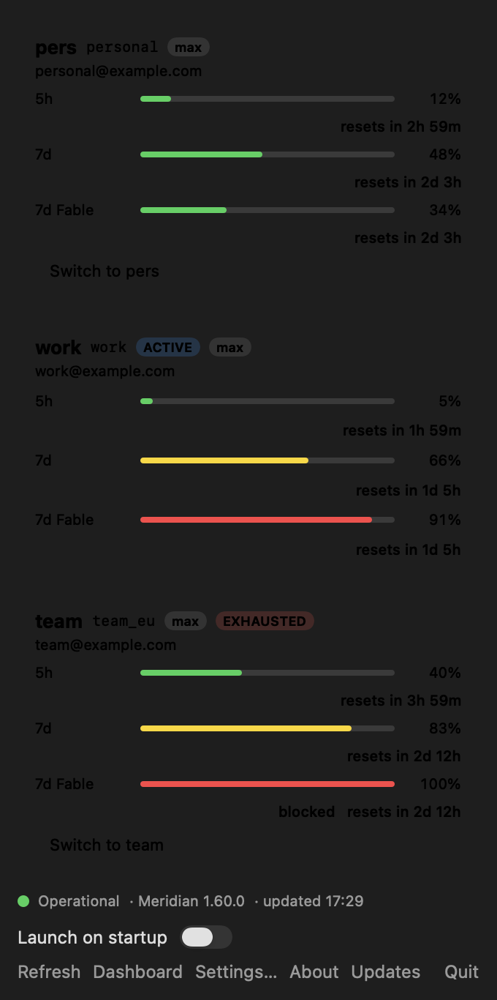

# MeridianBar

A native macOS menu bar app that watches **every Claude account** managed by
[Meridian](https://github.com/rynfar/meridian) — quota pressure per account,
always visible, and a live answer to "is the proxy even up?".

<p align="center"></p>
<p align="center"></p>
<p align="center"><sub>Staged data — real accounts never appear in this repo.</sub></p>

Meridian multiplexes several Claude Max accounts behind one local endpoint.
What it doesn't give you is ambient awareness: which account is about to hit
a rate-limit window, which one is exhausted, when the windows reset — and
whether Meridian itself is running. MeridianBar puts all of that in the menu
bar, per account, identified by name.

## Install

```bash
curl -fsSL https://raw.githubusercontent.com/Jean-Reinhold/meridian-bar/main/install.sh | bash
```

That's it — the script fetches the latest release, verifies its sha256,
installs to `/Applications`, and launches the app. Other options:

```bash
# Build and install from source (needs Command Line Tools, no Xcode)
curl -fsSL https://raw.githubusercontent.com/Jean-Reinhold/meridian-bar/main/install.sh | bash -s -- --from-source

# Remove it again
curl -fsSL https://raw.githubusercontent.com/Jean-Reinhold/meridian-bar/main/install.sh | bash -s -- --uninstall

# Or, from a clone
make install
```

> MeridianBar is ad-hoc signed, not Apple-notarized — a deliberate project
> decision (see [`okf/06`](okf/06-release.md)). Integrity comes from the
> published sha256, which the installer verifies. Homebrew cask and Sparkle
> in-app updates (stable/beta channels) are on the roadmap.

## What you see

- **In the bar** — one compact segment per profile: auto-abbreviated name +
  **7d Fable** utilization (the binding constraint for Fable-tier usage),
  colored by the *worst* window so it never looks green while something is
  blocking. The active profile is underlined. Meridian down → a gray
  `meridian ⏻` marker, within one poll.
- **On click** — per-account cards: every quota window (5h, 7d, 7d Fable, …)
  as a bar with percentage and reset countdown, email, plan, active /
  exhausted / login-needed badges, extra-usage credits, and a health footer
  with Meridian's version and data age.
- **Switch accounts** from the dropdown — one click, routed through
  `POST /profiles/active`.
- **Native and light** — SwiftUI `MenuBarExtra`, no Electron, no webview;
  an `LSUIElement` agent app idling in the tens of MB. Talks only to your
  loopback Meridian endpoint; no other network access.

## Requirements

- macOS 14+ (Liquid Glass look on macOS 26+, graceful material fallback below)
- [Meridian](https://github.com/rynfar/meridian) running locally
  (default `127.0.0.1:3456`, configurable)

## Developing

```bash
make build     # swift build -c release
make app       # assemble dist/MeridianBar.app
make run       # build + launch
make test      # unit tests
```

Plain Swift toolchain — Command Line Tools are enough; there is no Xcode
project. The design, verified Meridian API surface, feature plan, and all
decisions of record live in [`okf/`](okf/README.md). Contributions welcome —
see [CONTRIBUTING](CONTRIBUTING.md); questions go to
[Discussions](https://github.com/Jean-Reinhold/meridian-bar/discussions).

## License

MIT — see [LICENSE](LICENSE).
