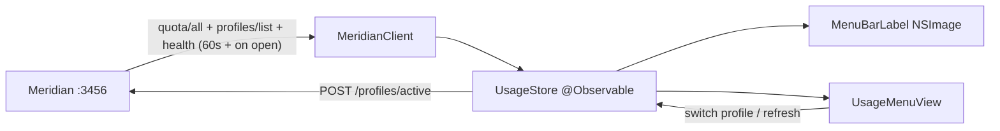

# Architecture

Module map, data flow, and the algorithms that need to be right. The design
goal is a single small executable with four source files and a pure-logic
core that is unit-testable without a running Meridian.

## Module map

```
Sources/MeridianBar/
  MeridianBarApp.swift    — @main entry, MenuBarExtra scene, poll lifecycle
  MeridianClient.swift    — URLSession + Codable bindings for the 4 endpoints
  UsageStore.swift        — @Observable state: merge, poll loop, offline flag
  UsageLogic.swift        — pure functions: status classification, aliasing,
                            window labels, countdown/percent formatting
  MenuBarLabel.swift      — NSImage renderer for the colored label
  UsageMenuView.swift     — SwiftUI dropdown
Tests/MeridianBarTests/   — decoding fixtures + UsageLogic tests
```

Dependency rule: `UsageLogic` imports Foundation only. `MeridianClient`
knows nothing about views. Views read `UsageStore` and never call the
client directly (except via store actions like `switchProfile`).

## Data flow



One poll cycle = the three GETs issued concurrently (`async let`), merged
into `[AccountState]` ordered by `profileOrder`. Any single failure marks
`offline = true` but **keeps the last good snapshot** with its timestamp —
the UI grays out rather than blanking.

## AccountState (merged model)

Per profile: `id`, `alias`, `email`, `subscriptionType`, `isActive`,
`loggedIn`, `isExhausted` (from `exhausted[]`), `windows: [WindowState]`
(type, utilization, resetsAt), `extraUsage?`, `fetchedAt`.
Derived: `worstUtilization` = max over windows; `status` = classification
of worst.

## Status classification

Mirror Meridian's own thresholds so both UIs always agree (`okf/01`):
`ok < 0.6 ≤ warn < 0.85 ≤ high`; `exhausted` when the profile appears in
`exhausted[]` or any window hits `utilization >= 1`. Colors: ok →
`labelColor`, warn → `systemYellow`, high → `systemOrange`, exhausted →
`systemRed`, offline → `secondaryLabelColor`.

## Profile aliasing (identification)

Requirement: the collapsed label must identify each account in ~3–5
characters. Pure function `aliases(for ids: [String]) -> [String: String]`:

1. Tokenize each id on `_-.` and case boundaries.
2. Strip the longest common prefix across all ids (token-wise first, then
   character-wise; only when ≥ 3 chars and ≥ 2 profiles).
3. Trim leading separators; take the first 4 chars, lowercase.
4. If stripping emptied a string, fall back to the last token, then to the
   first 4 chars of the original id.
5. On collision, extend by one char until unique.

Current profiles: `jeanpaul`/`jeanpnr`/`jean_reinhold` → common prefix
`jean` → **`paul` / `pnr` / `rein`**. A `UserDefaults` override map
(`aliasOverrides`) wins over the derived alias (settings feature F10).

## Menu bar label rendering

`MenuBarExtra` template rendering strips colors from plain text labels, so
the label is an **`NSImage` built with the block-based drawing handler**:
draw one `NSAttributedString` per segment (`alias pct%`, separator `·`),
menlo/system monospaced digits ~12 pt, baseline-centered in the 22 pt menu
bar. `isTemplate = false`. Dynamic `NSColor`s (label/system colors) resolve
at *draw time* inside the handler, so light/dark menu bar appearance is
handled by AppKit without listening for appearance notifications.

Offline: single gray segment `meridian off`. Label style variants
(F9: `full`, `dots`, `worst`) are alternate segment builders over the same
`[AccountState]`.

## Polling

- `Task` loop in `UsageStore`, `AsyncTimerSequence`-style sleep of
  `pollInterval` (default 60 s, `UserDefaults`).
- Immediate refresh when the menu opens (scene `onAppear`) and after
  `switchProfile`.
- All state mutation on `@MainActor`; the client is a stateless struct so
  concurrent polls can't race (a poll generation counter drops stale
  responses).

## Error handling rules

- Network error / non-200 / undecodable → `offline = true`, keep snapshot,
  never throw to the UI, never notify repeatedly.
- Unknown window `type` → title-case fallback label (`okf/01`), never a
  crash or a filtered-out row.
- Profile present in `quota/all` but missing from `profiles/list` (or vice
  versa) → render with whatever half is available.

## Risks / unknowns (falsifiable, checked in M1–M2)

- **R1** — colored non-template `NSImage` renders correctly in
  `MenuBarExtra` on macOS 14+ (known workaround for stripped text colors).
  *Refuted if* the image is forcibly templated → fall back to
  `NSStatusItem` via `NSApplicationDelegateAdaptor`.
- **R2** — SwiftPM under CommandLineTools links SwiftUI/AppKit for an
  `LSUIElement` bundle without Xcode. *Refuted if* SDK lacks modules →
  require full Xcode locally; CI unaffected.
- **R3** — label width for N profiles stays acceptable (~3 accounts ≈
  200 px). *Refuted if* users run many profiles → `dots`/`worst` styles
  (F9) become the default at N > 4.
